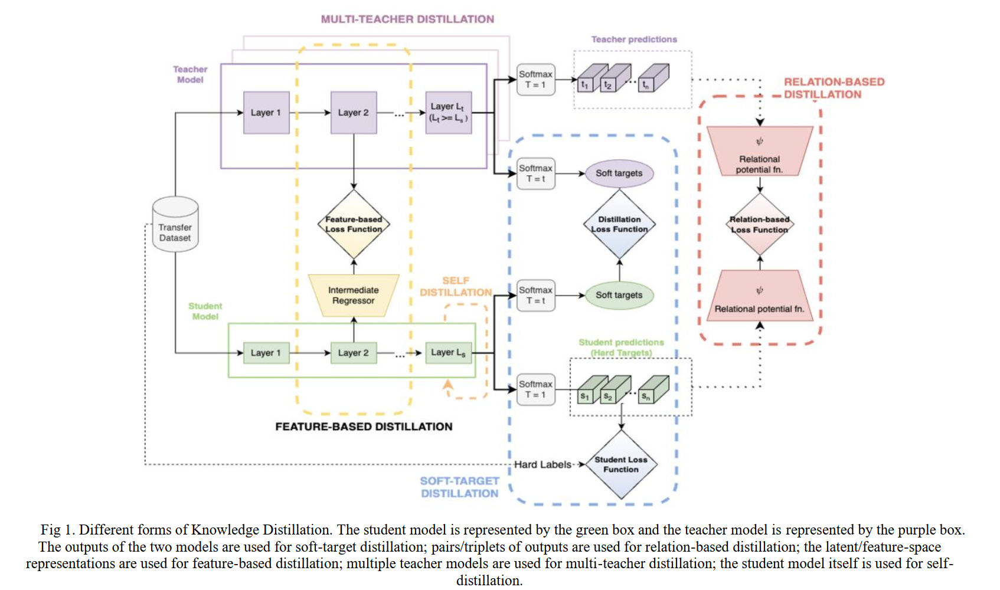

This survey paper provides a comprehensive overview of techniques for **compressing LLMs** to enable efficient inference in resource-constrained environments. 

To the best of our knowledge, this is the first paper that provides a focused survey of LLM compression techniques from the lens of resource constrained environments.

## Primary Approaches
- Knowledge Distillation
- Model Quantization
- Model Pruning

**Supplementary Techniques**, i.e. mixture-of-experts, early-exit etc.

## Resource Usages by some FAMOUS models
- **LLaMa-3 405B** does not fit in a single machine with 8 Nvidia H100 GPUs (800 GB of combined memory) and needs to be split across two machines for inference.
- **DeepSeek-V3** in 16-bit precision requires 1.34 TB of GPU memory.
- Even the **LLaMa 7B** model, in **16-bit precision**, requires 14 GB of GPU memory for the parameters and an additional 2 GB of memory for the Key-Value cache depending on the configuration.
- For **GPT-3 (2.7B version)**, each parameter requires about **2 floating-point operations (FLOPs)** per token.
  Since there are **2.7 billion parameters**, generating one token costs around **5.4 billion operations (5.4 GFLOPs)**.

Here’s the quick math.
### 1) Weights (the big chunk)
- Parameters: **7 billion**
- Precision: **16-bit = 2 bytes/param**
- Memory for weights = `7e9 × 2 bytes` = **14,000,000,000 bytes ≈ 14 GB**
### 2) KV cache (needed during inference)
For a transformer, per token per layer you store **K** and **V**:
- Size ≈ `2 × hidden_size × bytes`
- For a typical 7B model (e.g., LLaMA-7B): `hidden_size = 4096`, `layers = 32`
- Per token: `2 × 4096 × 2 bytes × 32 = 524,288 bytes ≈ 0.5 MB`
- For a 2,048-token context: `0.5 MB × 2,048 ≈ 1.0 GB`
### 3) Other buffers
Temporary activations, attention logits, padding/metadata, etc. often add **~1–3 GB**.
### Total (typical fp16 inference)
- **Weights:** ~14 GB
- **KV cache (2k context):** ~1 GB
- **Other buffers:** ~1–2+ GB  
    = **~16–18 GB** ⇒ “over **16 GB**” is accurate.
(If you quantize: INT8 → ~7 GB weights; 4-bit → ~3.5 GB, plus the same KV/overheads.)

## Basics

### Knowledge Distillation
Student models is trained to learn the feature predictions from the teacher. So, a fully-trained teacher model is used to run inference on a dataset (a.k.a. **transfer dataset**) and the predictions are called **soft targets**. 

The teacher uses a **high** value of **temperature** parameter **T** which gives a smoother probability distribution over classes which is actually more informative that binary true labels or only the most-likely next token (in case of LLMs).

The **student model** predictions also use the same value of temperature during training. The **cross entropy los**s (or Kullback-Leibler divergence loss) between the student model predictions and the soft targets, called **the distillation loss**, is **minimized**. \
The loss function also consists of a **second component** which minimizes the loss between student model predictions and the ground truth labels (hard targets), called **the student loss**.

**Two Types of Loss**:
- Distillation Loss (Student Model Predictions vs. Soft Targets)
- Student Loss (Student Model Predictions vs. Hard Targets)
  **temperature, T = 1**

**Final Loss**
- *Weighted sum* of the two-losses

**Different Types of KD**
1. **Soft-Target Distillation (Logit-based Distillation)**
   The student is trained using both **hard labels** (true data) and the teacher’s outputs:
   **Soft-target distillation:** uses teacher’s soft probabilities (smoothed with temperature). **Logit-based distillation:** matches teacher’s raw outputs (logits). \
    At inference, only hard labels matter. KD makes smaller models faster while keeping good accuracy.
    
2. **Feature-Based Distillation**
   The student learns from the **teacher’s intermediate layer features** (hints) instead of only the final output. \
   A **regressor** maps student features to match teacher features. Training is **two-stage**: first align features, then train on the main task. Challenges include choosing which layers to use and handling different feature sizes. \
   ✅ This helps the student learn the teacher’s **internal reasoning**, not just the final predictions.

3. **Relation-Based Distillation**
   Instead of matching outputs or features directly, the student learns the **relationships between data points** in the teacher’s latent space. \
   **Distance-wise loss:** student aligns pairwise distances between points with the teacher. **Angle-wise loss:** student aligns angles formed by triplets of points with the teacher. \
   ✅ This preserves the **structural relationships** the teacher has learned, not just individual outputs or features.

4. **Self-Distillation:** The model learns from **itself** or earlier versions instead of a separate teacher. So, *no dependency* on a larger-LLM for training. \
   Later layers can teach earlier layers, or old model versions can teach new ones. \
   Acts as **regularization**, smoothing predictions and improving accuracy. \
   Useful for **smaller models** in resource-limited settings.

5. **Multi-Teacher Distillation:** The student learns from **multiple teachers** at once. \
   Teachers may be trained on different datasets or tasks. \
   Distillation can combine **soft-target** and **relation-based** methods. \
   Helps the student **absorb diverse knowledge** from multiple sources.